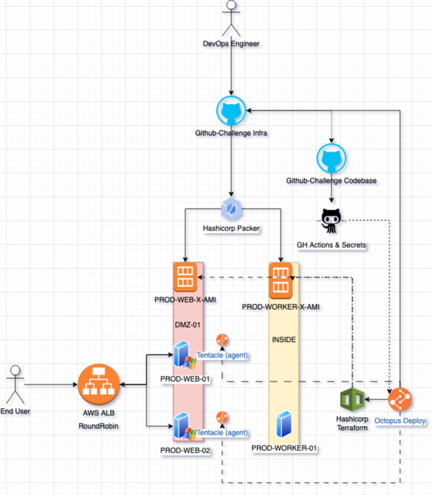

# Infrastructure Suite Demo with Built-In Instrumentation

## Note: Improvements are added in a [PR-1](https://github.com/nstankov-bg/-more-vmy-random-dotnet-project-poc/pull/1), but outside of the original time-limits.

## Motivation:

This repository demonstrates an infrastructure suite with a focus on operational convenience and reproducibility.

## Motivation

- A demonstration of an in-the-middle infrastructure suite, with instrumentation built around operational convenience & reproducibility 🚀

## Given more time

- Register nodes into target groups & ASG(s) 📝
- Register load balancer(s) to point to target group(s) 📝
- Register ACM & Sub-Domain for https([Self-Signed Certs are no good](https://www.appviewx.com/blogs/risks-of-self-signed-certificates/)) 🔒

## Diagram

## Demo

DEV:

- http://3.76.20.32/api/weather

PROD: (close your eyes and imagine a load-balancer)

- http://18.198.105.88/api/weather
- http://3.76.20.32/api/weather

## 📜 SRC Description

- A random-off-the shelf stateless app ( because stateless means happy Ops ) app, that simulates a weather API at `/api/weather` ☁️

## 🚀 Features

- 🚀 Uses Packer to create "Golden AMI(s)"
- 📦 Uses Terraform to provision
- 💽 Uses a managed MSSQL Cluster in RDS via TF
- 🚀 Uses Octopus Deploy (trial) as CD
- 🚀 Uses GithubActions x Octopus Deploy to build
- 🎁 Uses Github Submodules to wrap infra around project
- 📜 Uses Make for basic scripting convenience

## 🧪 BETA Features

- [ ] Uses Github Actions to push a "trigger" for fully automated releases
- [ ] Add S3 Bucket for Octopus Deploy to store artifacts
- [ ] Add S3 Bucket for Terraform to store state & lock via DynamoDB
- [ ] Experiment with ASG(s) & Target Groups, as tenants to Octopus Deploy

## 🛠️ TODO

- [x] Implement SEMVER
- [x] Implement Github Actions for basic CI
- [ ] Implement CIS Benchmark and Hardening for security.

## Where you'll need context:

- [ ] AWS Account
- [ ] 00-Packer/AWS/AMI/DEV/DEV-WEB-X-AMI/bootstrap_win.txt
- [ ] 00-Packer/AWS/AMI/DEV/DEV-WORKER-X-AMI/docker/octopus/.env
- [ ] 00-Packer/AWS/AMI/PROD/PROD-WEB-X-AMI/bootstrap_win.txt
- [ ] 00-Packer/AWS/AMI/PROD/PROD-WORKER-X-AMI/docker/octopus/.env
- [ ] 01-Terraform/AWS/EC2/DEV/DEV-WEB-01/terraform.tfvars
- [ ] 01-Terraform/AWS/EC2/DEV/DEV-WORKER-01/terraform.tfvars
- [ ] 01-Terraform/AWS/EC2/DEV/DEV-WORKER-MSSQL-01/terraform.tfvars
- [ ] 01-Terraform/AWS/EC2/PROD/PROD-WEB-02/terraform.tfvars
- [ ] 01-Terraform/AWS/EC2/PROD/PROD-WEB-03/terraform.tfvars
- [ ] 01-Terraform/AWS/EC2/PROD/PROD-WORKER-01/terraform.tfvars
- [ ] 01-Terraform/AWS/EC2/PROD/PROD-WORKER-02/terraform.tfvars
- [ ] 01-Terraform/AWS/EC2/PROD/PROD-WORKER-MSSQL-01/terraform.tfvars
